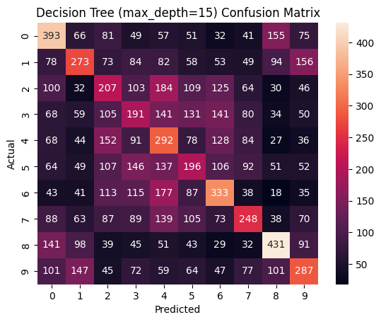

# AI Midterm Report — Eric Gerner

## 1. Preprocessing Summary
- **Dataset**: CIFAR-10, which consists of 50,000 training and 10,000 test images across 10 classes.
- **What I Did**:
  - Loaded data batches from downloaded folder.
  - Normalized pixel values to range [0, 1].
  - Flattened each 32×32×3 image into 3072-dimensional vectors.

## 2. Model Development & Hyperparameter Tuning

| Model         | Key Hyperparameter(s)     | Value(s) Used             |
|---------------|----------------------------|---------------------------|
| KNN           | `n_neighbors`              | 5, 10                     |
| Decision Tree | `max_depth`                | 15,                       |
| Random Forest | `n_estimators`             | 100, 150                  |
| SVM (SVC)     | `C`                        | 5.0, 10.0                 |
| MLP           | `max_iter`                 | 200, 400                  |

## 3. Evaluation Metrics
### first run
| Model         | Accuracy | Precision | Recall | F1 Score |
|---------------|----------|-----------|--------|----------|
| KNN           | 0.34     | 0.43      | 0.34   | 0.33     |
| Decision Tree | 0.29     | 0.29      | 0.29   | 0.29     |
| Random Forest | 0.47     | 0.47      | 0.47   | 0.47     |
| SVM           | 0.57     | 0.57      | 0.57   | 0.57     |
| MLP           | 0.49     | 0.49      | 0.49   | 0.49     |
### tuned run
| Model         | Accuracy | Precision | Recall | F1 Score |
|---------------|----------|-----------|--------|----------|
| KNN           | 0.34     | 0.46      | 0.34   | 0.32     |
| Decision Tree | 0.27     | 0.27      | 0.27   | 0.27     |
| Random Forest | 0.48     | 0.47      | 0.48   | 0.48     |
| SVM           | 0.57     | 0.57      | 0.57   | 0.57     |
| MLP           | 0.48     | 0.45      | 0.48   | 0.48     |

## 4. Confusion Matrices

## 5. Insights & Model Comparison

- **Best Performing Model**: _SVM_ — because it achieved the highest _stats_ with generalizable predictions.
- **Worst Performing Model**: _Decision tree_ — possibly due to _overfitting/high bias/slower convergence_.
- **Why Some Models Work Better**:
  - SVM and MLP handle high-dimensional space better.
  - KNN is sensitive to noise and lacks generalization.
  - Random Forest and Decision Tree vary with depth and ensemble size.